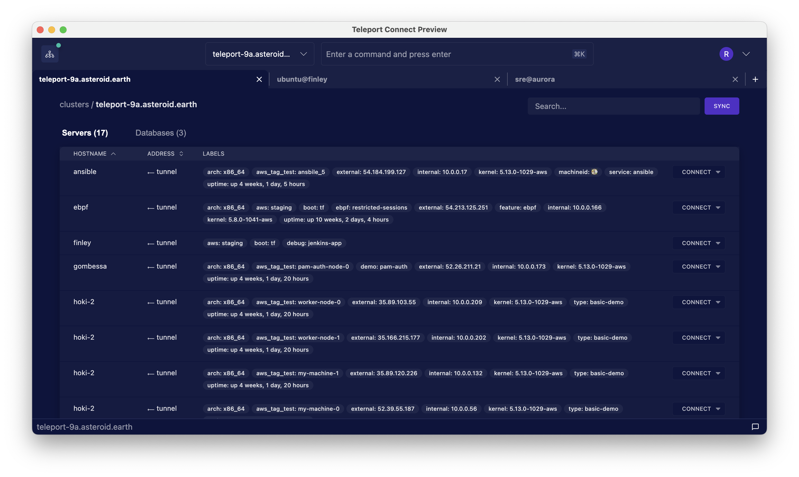

Teleport Connect provides easy and secure access to SSH servers and databases, with support for
other resources such as Kubernetes clusters and application access coming in the future.

## Download

Head over to the [Downloads](https://goteleport.com/download/) page to download the most recent
version of Teleport Connect. As of now, Teleport Connect supports macOS only.

## Installation

Double-click the downloaded .dmg file and drag the Teleport Connect icon to the Applications folder.

## Upgrade

To upgrade Teleport Connect to a newer version, download the .dmg file with that version and then
follow the installation steps.

## Next Steps

Check out the [Getting Started](getting-started) guide on how to use Teleport Connect in your day-to-day work.
